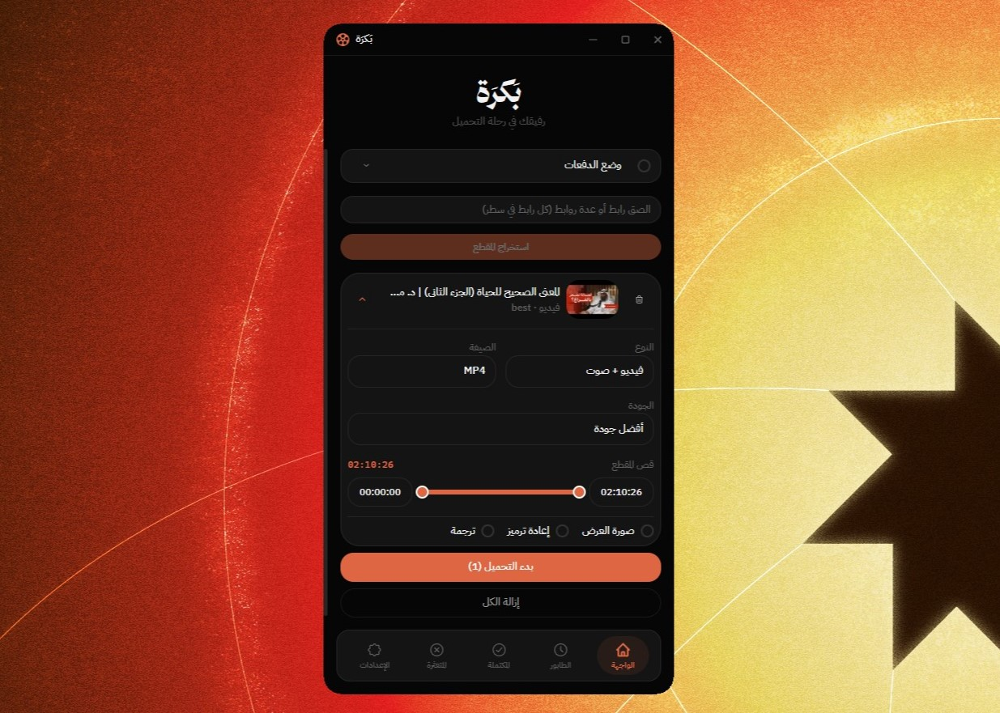

# بَكرَة

**من الإيديتورز إلى الإيديتورز**

أداة تحميل تجيب لك المادة الخام جاهزة للتايم لاين — لا مواقع مشبوهة، لا إعلانات، لا ملفات ناقصة.

 

 

### [⬇️ حمّل آخر إصدار](https://github.com/iMait00/bakara/releases/latest)

 

---

## ✨ ليش بَكرَة؟

بَكرَة مبني من إيديتور عانى من نفس المشاكل: تنزل مقطع من موقع إعلانات، تكتشف إنه بجودة أقل، الترجمة تجيك بصيغة ما يقراها البرنامج، ومجلد الدرايف يجيك مقسّم zip أو يوقفك حظر بنص التحميل.

| | |
|---|---|
| 🎬 | **أي فيديو من الإنترنت**  YouTube وأكثر من ألف موقع، بأعلى جودة متوفرة |
| 📁 | **مجلدات Google Drive كاملة** بدون ما ينقسم إلى zip وبدون ما يوقفك حظر التحميل |
| ✂️ | **قص المقطع قبل التحميل** تحدد البداية والنهاية وتنزّل الجزء اللي تحتاجه بس |
| 💬 | **ترجمة بصيغة SRT** يقراها بريمير ودافينشي وكاب كت مباشرة، مع خيار تقسيم الكلمات |
| 🖼️ | **صور العرض** الثمبنيل بأعلى دقة، جاهز للتصميم |
| 🎵 | **فيديو أو صوت**  MP4 / MOV / AVI أو MP3 / AAC / Opus |
| 📋 | **دفعة كاملة مرة وحدة** الصق روابط بعدد ما تبي وخلّها تشتغل |
| 🌙 | **واجهة عربية بالكامل** RTL من أول زر لآخر رسالة خطأ |

### 🔜 قريباً

**إزالة الموسيقى** — تفصل الصوت عن الخلفية الموسيقية، عشان تاخذ التعليق نظيفاً.

---

## 💻 التحميل

نزّل الملف المناسب لجهازك من [صفحة الإصدارات](https://github.com/iMait00/bakara/releases/latest):

| النظام | الملف |
|--------|-------|
| Windows | `Bakara_x.y.z_x64-setup.exe` أو `Bakara_x.y.z_x64_en-US.msi` |
| macOS (Apple Silicon) | `Bakara_x.y.z_aarch64.dmg` |
| macOS (Intel) | `Bakara_x.y.z_x64.dmg` |

### أول تشغيل

التطبيق ينزّل أدواته بنفسه (yt-dlp و FFmpeg و aria2c) عند أول تشغيل — ما تحتاج
تثبّت أي شيء يدوياً. خلّ الاتصال بالإنترنت شغّالاً وانتظر انتهاء التهيئة.

> **ملاحظة لمستخدمي macOS:** التطبيق غير موقّع بشهادة Apple، فأول مرة افتحه
> بزر الفأرة الأيمن ← **Open** ثم أكّد.
>
> **ملاحظة لدعم مجلدات Google Drive:** يحتاج [Python](https://www.python.org/)
> 3.11+ مع الحزمة `gdown` (`pip install gdown`). باقي المميزات تشتغل بدونه.

---

## 📋 الرخصة

**© 2026 iMait00 — جميع الحقوق محفوظة.**

بَكرَة برنامج **مغلق المصدر وملكية خاصة**. هذا المستودع يحتوي على الإصدارات
الجاهزة فقط، والكود المصدري غير منشور.

يُمنع منعاً باتاً بدون إذن كتابي مسبق:

- بيع التطبيق أو المتاجرة به بأي صورة
- إعادة توزيعه أو رفعه على مواقع أخرى
- تعديله أو اشتقاق أعمال منه
- عكس هندسته أو محاولة استخراج كوده المصدري
- استخدام اسم «بَكرَة» أو شعاره أو هويته البصرية

التفاصيل الكاملة في [LICENSE](LICENSE).

### إخلاء مسؤولية

يُقدَّم البرنامج «كما هو» دون أي ضمان. بَكرَة أداة تقنية عامة، ويتحمل المستخدم
وحده مسؤولية التزامه بشروط خدمة المواقع اللي يستخدمها معها وبقوانين حقوق
المؤلف السارية عليه.

### أدوات خارجية

لا يتضمن هذا المستودع ولا الإصدارات أي أدوات خارجية. ينزّل التطبيق yt-dlp و
FFmpeg و aria2c من مصادرها الرسمية على جهازك، وتخضع كلٌّ منها لرخصتها الخاصة.

---

**صُنع بـ ❤️ بواسطة [iMait00](https://github.com/iMait00)**

